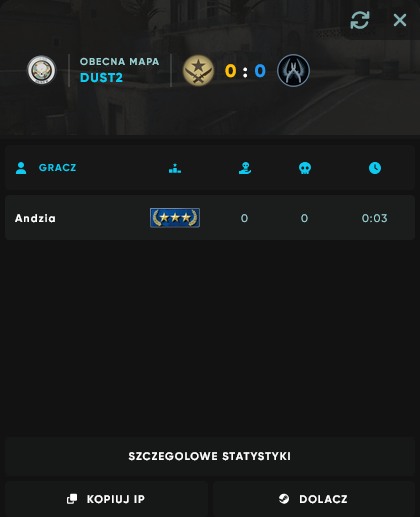

# ServerInfo-for-LR-WEB
> [!IMPORTANT]
> This plugin was made by [Stimayk](https://github.com/Stimayk/ServerInfo-for-LR-WEB). This is a fork of this plugin where I recompiled it to the newest versions of packages that it was using and did some changes and "repair" some stuff that made this plugin more up to date.
# EN:
This plugin inserts data into .json file that is in Rich-Monitoring module created for Level Ranks Web with Rich theme. This allow to see player statistics on website before entering the server. It works fine with [CS2-Ranks by partiusfabaa (v2.0.5.2)](https://github.com/partiusfabaa/cs2-ranks), I did not tested it with other plugins such as ABKAM2023 RankPoints or Metamod Level ranks by Pisex. It updates data on round start or by changing Monitoring module to send css_getserverinfo via RCON. 
Since I don't know what I am doing here and just made rookie stuff mostly copying and pasting code I probably won't be doing much updates to it. I think it works pretty well.

<details> 
  <summary>Showcase</summary>
  
</details>

## Requirements:
- LR Web (Rich theme) + Rich Monitoring (Found on Stellar Team discord server),
- CounterStrikeSharp (Tested on v279),
- [CS2-Ranks by partiusfabaa (v2.0.5.2)](https://github.com/partiusfabaa/cs2-ranks),

## Commands:
- css_getserverinfo - Force sending new data into json file.

## Installation:
###  Server:
- Upload plugin files into *addons/counterstrikesharp/plugins/*,
- Restart the server,
- After restarting the server, config file should be created at *addons/counterstrikesharp/configs/plugins/ServerInfo*
```
    // This configuration was automatically generated by CounterStrikeSharp for plugin 'ServerInfo', at 2024/10/17 11:22:59
    {
    "server_info": "", // <- Server ip with port such as: 127.0.0.1:27015
    "password": "penis123", // // <- Password that monitoring module uses
    "url": "https://rank.pierdolnik.eu", // <- URL to your website where level ranks web is installed
    "debug_mode": true, // <- True / False, either if you want to have your console be spammed with debug stuff
    "statistic_type": 2, // <- **0** - Not using any plugin that displays rank, **1** Ranks points by ABKAM2023, **2** CS2-Ranks by partiusfabaa, **3** Metamod Level ranks by Pisex
    "ConfigVersion": 1 // <- Better not to touch :3
    }
```
- For correct rank and in real time players information displaying server hibernation should be at false (0),
- Restart server again or reload the plugin

## Website module:
- Download module from Stellar Team discord,
- Install it like any other module,
- Go to /forward/js_controller.php and change password on the line 5 ($password == "some russian stuff (change to the password you have given in plugin config)")
- If in module folder, folder named "servers" is absent, create one,
- Additionaly you can insert RCON password to the database where you have given your server ip, name and other stuff (lvl_web_servers) and change command sending by the module in: module_block_main_monitoring_rating/ext/js_controller.php
```
    $_RCON->Command( "sm_getserverinfo");
    to:
    $_RCON->Command( "css_getserverinfo");
```
- Restart module in admin panel

